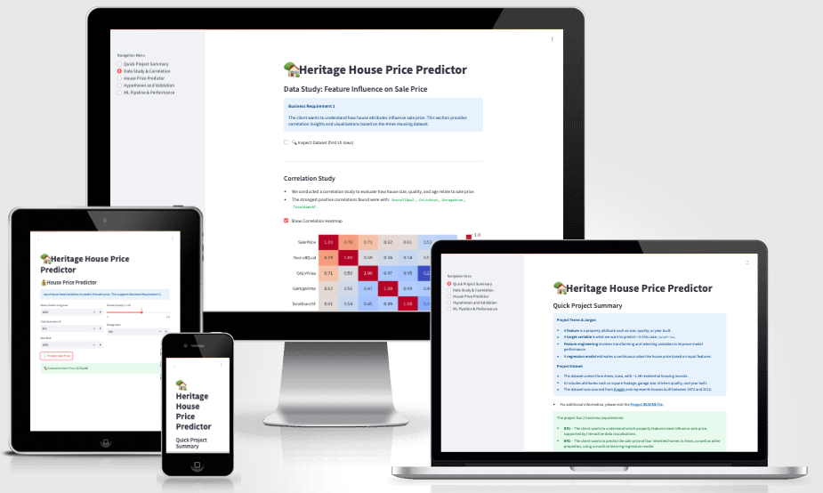

# Heritage House Price Predictor - ML


[Live Page](https://heritage-house-jth-8009aedd997c.herokuapp.com/)

## Overview <a name="overview"></a>

The Heritage House Price Predictor is a data-driven project developed to help a client determine accurate sale prices for a set of inherited homes in **Ames, Iowa**. The primary aim is to estimate the total expected value of these properties and to understand how specific features—such as location, size, and condition—impact their market price.

Using a combination of **data analysis**, **machine learning**, and **interactive visualisation**, this project delivers actionable insights through a **Streamlit web application** (deployed via Render or Heroku). The user-friendly interface allows the client to explore predictions, input their own property values, and understand the model’s logic in real time.

The project follows the **CRISP-DM (Cross Industry Standard Process for Data Mining)** methodology. This structured approach ensures that the workflow—from understanding business needs to evaluating predictive models—is transparent and repeatable.

---
<a name="top"></a>

## Table of Contents

* [Overview](#overview)
* [Dataset Content](#dataset-content)
* [Business Requirements](#business-requirements)
* [Hypotheses and Validation](#hypotheses-and-how-to-validate)
* [ML Business Case](#ml-business-case)
* [Data Preparation and Feature Engineering](#data-preparation-and-feature-engineering)
* [Model Iteration and Tuning Strategy](#model-iteration-and-tuning-strategy)
* [Agile Workflow](#agile-workflow)
* [Dashboard Design](#dashboard-design-streamlit-app-user-interface)
* [Deployment](#deployment)
* [Main Libraries](#main-data-analysis-and-machine-learning-libraries)
* [Credits](#credits)

---

## Dataset Content <a name="dataset-content"></a>

* The dataset is sourced from [Kaggle](https://www.kaggle.com/codeinstitute/housing-prices-data). We then created a fictitious user story where predictive analytics can be applied in a real project in the workplace.
* The dataset has almost 1.5 thousand rows and represents housing records from Ames, Iowa, indicating house profile (Floor Area, Basement, Garage, Kitchen, Lot, Porch, Wood Deck, Year Built) and its respective sale price for houses built between 1872 and 2010.

|Variable|Meaning|Units|
|:----|:----|:----|
|1stFlrSF|First Floor square feet|334 - 4692|
|2ndFlrSF|Second-floor square feet|0 - 2065|
|BedroomAbvGr|Bedrooms above grade (does NOT include basement bedrooms)|0 - 8|
|BsmtExposure|Refers to walkout or garden level walls|Gd: Good Exposure; Av: Average Exposure; Mn: Minimum Exposure; No: No Exposure; None: No Basement|
|BsmtFinType1|Rating of basement finished area|GLQ: Good Living Quarters; ALQ: Average Living Quarters; BLQ: Below Average Living Quarters; Rec: Average Rec Room; LwQ: Low Quality; Unf: Unfinshed; None: No Basement|
|BsmtFinSF1|Type 1 finished square feet|0 - 5644|
|BsmtUnfSF|Unfinished square feet of basement area|0 - 2336|
|TotalBsmtSF|Total square feet of basement area|0 - 6110|
|GarageArea|Size of garage in square feet|0 - 1418|
|GarageFinish|Interior finish of the garage|Fin: Finished; RFn: Rough Finished; Unf: Unfinished; None: No Garage|
|GarageYrBlt|Year garage was built|1900 - 2010|
|GrLivArea|Above grade (ground) living area square feet|334 - 5642|
|KitchenQual|Kitchen quality|Ex: Excellent; Gd: Good; TA: Typical/Average; Fa: Fair; Po: Poor|
|LotArea| Lot size in square feet|1300 - 215245|
|LotFrontage| Linear feet of street connected to property|21 - 313|
|MasVnrArea|Masonry veneer area in square feet|0 - 1600|
|EnclosedPorch|Enclosed porch area in square feet|0 - 286|
|OpenPorchSF|Open porch area in square feet|0 - 547|
|OverallCond|Rates the overall condition of the house|10: Very Excellent; 9: Excellent; 8: Very Good; 7: Good; 6: Above Average; 5: Average; 4: Below Average; 3: Fair; 2: Poor; 1: Very Poor|
|OverallQual|Rates the overall material and finish of the house|10: Very Excellent; 9: Excellent; 8: Very Good; 7: Good; 6: Above Average; 5: Average; 4: Below Average; 3: Fair; 2: Poor; 1: Very Poor|
|WoodDeckSF|Wood deck area in square feet|0 - 736|
|YearBuilt|Original construction date|1872 - 2010|
|YearRemodAdd|Remodel date (same as construction date if no remodelling or additions)|1950 - 2010|
|SalePrice|Sale Price|34900 - 755000|

[Back to Top](#top)

---

## Business Requirements <a name="business-requirements"></a>

Your friend has inherited four homes in Ames, Iowa, from her late great-grandfather. While she understands property values well in her home state, she is concerned that relying on that knowledge in a different location could lead to **inaccurate appraisals**.

She found a **public dataset of Ames house sales** and has asked you, as a good friend with data skills, to help her make better-informed decisions about selling the inherited properties.

### Summary of Client Requirements

1. **Correlation Analysis:**  
   The client wants to understand how house features correlate with sale price. She expects **data visualisations** to help identify which features (e.g., size, age, quality) are most influential.

2. **Price Prediction Model:**  
   The client wants to **predict the sale price** of her four inherited homes and be able to predict prices for **other homes** in Ames using a trained machine learning model.

[Back to Top](#top)

---

## Hypotheses and How to Validate <a name="hypotheses-and-how-to-validate"></a>

1 – **We suspect that larger houses tend to sell for higher prices.**  
→ Validated using a Pearson correlation analysis between `GrLivArea` and `SalePrice`.

2 – **We believe that houses with higher quality ratings are more valuable.**  
→ Validated using a Pearson correlation between `OverallQual` and `SalePrice`.

3 – **We suspect that newer or recently renovated houses sell for more.**  
→ Validated using correlations between `YearBuilt`, `YearRemodAdd`, and `SalePrice`.

### What We Found

We tested these three hypotheses using statistical correlation scores and data visualisations. The results were:

* **Larger houses really do sell for more.**  
  * `GrLivArea` had a strong positive Pearson correlation with `SalePrice` (**0.71**).
  * `GarageArea` (0.64) and `TotalBsmtSF` (0.61) also showed strong positive relationships.
  * **Course of Action**: Lydia should prioritise larger homes in terms of living space, garage, and basement when setting prices. She can highlight these attributes when marketing.

* **Higher quality makes a big difference.**  
  * `OverallQual` showed the strongest correlation with `SalePrice` (**0.79**), making it the most predictive feature.
  * `KitchenQual` had a strong correlation as well (**0.67**).
  * **Course of Action**: Lydia could consider minor renovations or staging to improve the perceived or actual quality of homes before selling. Homes with higher quality ratings should be priced at a premium.

* **Newer homes are slightly more expensive.**  
  * `YearBuilt` (0.52) and `YearRemodAdd` (0.51) had moderate correlations with `SalePrice`.
  * **Course of Action**: Emphasise renovation history and the modernity of any structural updates in property listings. For older homes, recent remodelling should be showcased prominently.

These findings gave us clear, data-driven direction when selecting features for the machine learning model and allowed Lydia to make strategic pricing and marketing decisions.

[Back to Top](#top)

---

## Rationale to Map the Business Requirements to Data Visualisations and ML Tasks <a name="rationale-to-map-the-business-requirements-to-data-visualisations-and-ml-tasks"></a>

To address the client’s goal of maximising the sale price of the inherited homes, this project translates each business requirement into actionable data analysis and machine learning tasks.

### Business Requirement 1: Understand How House Attributes Influence Sale Price

**Client Expectation:**  
Identify which house features most influence the sale price through clear, informative visualisations.

**Mapped Tasks:**

* Load, clean, and explore the Ames housing dataset.
* Conduct correlation analysis using Pearson and Spearman methods.
* Visualise key relationships (e.g., scatter plots, boxplots, heatmaps).
* Test hypotheses about size, quality, and year built.
* Present results clearly in a format the client can understand.

These correlation results confirmed our initial assumptions about house size, quality, and age.  
They also helped us choose the top features that will be used in the machine learning model:  
`OverallQual`, `GrLivArea`, `KitchenQual`, `GarageArea`, and `TotalBsmtSF`.

### Business Requirement 2: Predict the Sale Price of Inherited Houses and Others in Ames

**Client Expectation:**  
Use a machine learning model to predict the sale prices of the four inherited homes and any future homes.

**Mapped Tasks:**

* Select important features based on correlation and domain knowledge.
* Preprocess and engineer data for ML modeling.
* Train and evaluate regression models (e.g., Linear Regression, Random Forest).
* Assess model performance using R² and MAE.
* Deploy the model via a user-friendly **Streamlit app** to allow real-time prediction.

To support real-time prediction in the deployed Streamlit application, a simplified machine learning pipeline was created using only the top 5 most influential features (`GrLivArea`, `OverallQual`, `GarageArea`, `TotalBsmtSF`, `YearBuilt`).
This streamlined version of the model is trained separately and saved specifically for the web app. It removes the need for complex preprocessing steps like categorical encoding and missing value imputation, which would complicate the user experience.
The full-featured pipeline with all transformations and tuning remains documented and evaluated in the modeling notebook. This design ensures that the application remains responsive and user-friendly while still providing reliable predictions based on the most impactful variables.

This structured process ensures that the client's goals are met through both **insightful visual analysis** and a **practical predictive tool**, in line with the **CRISP-DM** methodology.

[Back to Top](#top)

---

## ML Business  <a name="ml-business-case"></a>

### What are we trying to predict?

We want to build a machine learning model that can **predict the sale price of a house** in Ames, Iowa, based on its characteristics (e.g. size, condition, year built, etc.).

The target variable, `SalePrice`, is a **continuous numerical variable**, so we are using a **Regression Model**.

This is a **supervised learning** task because the target variable is already known for the training data.

### What is the goal of the ML system?

To help the client:

* Predict the sale prices of the 4 inherited houses.
* Explore and compare estimated sale prices for other houses in Ames, Iowa.
* Understand which house features have the biggest impact on price.

### What makes the model successful?

**Success Criteria (as agreed with the client):**

* R² score of **at least 0.75** on both the training and test sets.
* Visual inspection of **Actual vs Predicted Sale Price** to confirm that predictions align closely with real prices.

**Failure Criteria:**

* If after 12 months of use, **more than 30% of predictions differ from the real sale price by more than 40%**, the model will be considered expired and due for retraining.
* If R² drops below 0.60 on new data, retraining will also be required.

### What are the model's inputs and outputs?

* **Inputs:** House attribute information such as square footage, quality rating, basement area, kitchen quality, garage size, etc.
* **Output:** A **numeric value** representing the predicted sale price in USD.

### What happens with the model?

* The model is deployed in a **Streamlit web app**.
* Users can interact with sliders and dropdowns to input house features.
* The model makes a prediction instantly, and the app shows the estimated price along with key feature insights.

### Heuristics and training data

* The training data comes from the publicly available **Ames, Iowa housing dataset** on Kaggle.
* It contains ~1500 housing records from the years 1872–2010.
* No sensitive or personally identifiable data is used.

[Back to Top](#top)

---

## Data Preparation and Feature Engineering <a name="data-preparation-and-feature-engineering"></a>

A dedicated **feature engineering notebook** was used to explore and apply appropriate transformations to the dataset before training the machine learning model. This step ensured data consistency, improved model accuracy, and reduced the impact of outliers and skewness.

### Transformations Applied

* **Ordinal Encoding**  
  Applied to categorical variables such as `BsmtExposure`, `BsmtFinType1`, `GarageFinish`, and `KitchenQual` using `OrdinalEncoder` from the `feature-engine` library. Missing values were imputed with `'None'` before encoding.

* **Numerical Transformations**  
  Several techniques were tested on skewed numeric features (`LotArea`, `GrLivArea`, `MasVnrArea`, `TotalBsmtSF`, `1stFlrSF`, `2ndFlrSF`, `OpenPorchSF`) to improve normality:
  * Natural log (`log_e`)
  * Base 10 log (`log_10`)
  * Reciprocal
  * Power transform
  * Box-Cox transform
  * Yeo-Johnson transform

  Each transformation was evaluated using **histograms, QQ plots, and boxplots** to determine distribution improvement and visual normality.

* **Outlier Handling (Winsorization)**  
  The **IQR method** was used via `Winsorizer` to cap extreme values in numeric features, reducing the influence of outliers.

### Validation Strategy

* All transformations were applied using a custom function `FeatureEngineeringAnalysis`, which logged successful and unsuccessful attempts.
* Diagnostic plots (histograms, QQ plots, boxplots) were reviewed for every transformation to assess normalisation impact.
* Transformations were selected based on their **visual improvement** and their **contribution to predictive performance**, measured during model iteration.

This structured and justified approach to data preparation ensures compliance with **CRISP-DM’s Data Preparation stage**.

[Back to Top](#top)

---

## Model Iteration and Tuning Strategy <a name="model-iteration-and-tuning-strategy"></a>

To ensure the most accurate and generalisable predictions, multiple regression models were evaluated and fine-tuned using `GridSearchCV` with 5-fold cross-validation. The goal was to identify the model and hyperparameter combination that yielded the highest R² score.

### Models Evaluated

1. **Linear Regression** – Used as a baseline model (no hyperparameters to tune).
2. **Random Forest Regressor**
3. **Gradient Boosting Regressor**
4. **XGBoost Regressor**

Each model was wrapped into a complete pipeline that included imputation, encoding, transformations (e.g., YeoJohnson and log), feature selection, and scaling.

### Hyperparameter Tuning Strategy

For models that support tuning, the following hyperparameters were tested:

#### Random Forest Regressor

* `n_estimators`: [50, 100, 150] – Controls the number of trees in the forest.
* `max_depth`: [None, 5, 15] – Limits tree depth to prevent overfitting.
* `min_samples_split`: [2, 5, 10] – Minimum samples required to split an internal node.

#### Gradient Boosting and XGBoost

* `n_estimators`: [100] – Standard number of boosting rounds.
* `learning_rate`: [0.1, 0.01] – Shrinks the contribution of each tree (learning rate vs. overfitting trade-off).

### Evaluation and Selection

* **Performance Metric**: R² (coefficient of determination) was used for cross-validation scoring.
* **Best Model**: The **Linear Regression** model achieved the highest cross-validated R² score with the simplest structure and no tuning required. It was therefore selected as the final model for both evaluation and deployment.
* No hyperparameters were tuned for Linear Regression, as it performed best in its default configuration.

This model performed robustly on both training and test sets, and its predictions were further evaluated using Actual vs Predicted plots and Mean Absolute Error (MAE).

A version of the Linear Regression model trained on the top 5 most predictive features (GrLivArea, OverallQual, GarageArea, TotalBsmtSF, YearBuilt) was saved and deployed to the Streamlit dashboard for real-time prediction. This simplified model preserves accuracy while enhancing usability and interpretability.

[Back to Top](#top)

---

## Agile Workflow <a name="agile-workflow"></a>

To manage this project effectively, I used an agile approach based on the **CRISP-DM methodology**, supported by:

* **Epics** and **User Stories** to break the project into actionable goals
* A visual **[Kanban board](https://github.com/users/justynath/projects/11/views/1)** to track progress and maintain focus throughout the project
* **MoSCoW prioritisation** to focus on what matters most

### Epics

* **EPIC 1: Business & Data Understanding**  
  Define the business problem and explore the dataset to ensure it supports the ML goal.

* **EPIC 2: Data Preparation**  
  Clean and transform the dataset to make it ready for machine learning.

* **EPIC 3: Modelling & Evaluation**  
  Build, train, and evaluate models to address the business objective.

* **EPIC 4: Deployment & Dashboard**  
  Develop and deploy a Streamlit dashboard to present insights and predictions.

* **EPIC 5: Documentation & Review**  
  Document the project comprehensively and ensure it is reproducible and understandable.

### User Stories

* **USER STORY 1: Define business objectives and success criteria**
  * Epic: Business & Data Understanding
  * Priority: Must
  * As a data practitioner, I want to define the business goals so that I can align the ML system with the client's needs.

* **USER STORY 2: Explore and understand the dataset**  
  * Epic: Business & Data Understanding
  * Priority: Must
  * As a data practitioner, I want to explore the dataset to check if it can answer the business question.

* **USER STORY 3: Clean and structure the data**  
  * Epic: Data Preparation
  * Priority: Must
  * As a data practitioner, I want to clean and structure the dataset so that it can be reliably used in modelling.

* **USER STORY 4: Engineer new features for modelling**  
  * Epic: Data Preparation
  * Priority: Should
  * As a data practitioner, I want to create new features that improve model performance.

* **USER STORY 5: Build and evaluate ML models**  
  * Epic: Modelling & Evaluation
  * Priority: Must
  * As a data practitioner, I want to build and evaluate models so that I can predict house prices accurately.

* **USER STORY 6: Improve model with hyperparameter tuning**  
  * Epic: Modelling & Evaluation
  * Priority: Should
  * As a data practitioner, I want to optimise the model using tuning to improve predictive performance.

* **USER STORY 7: Build a dashboard for prediction and insights**  
  * Epic: Deployment & Dashboard
  * Priority: Must
  * As a stakeholder, I want a dashboard where I can input house details and get sale price predictions.

* **USER STORY 8: Add visualisations and interactivity to dashboard**  
  * Epic: Deployment & Dashboard
  * Priority: Should
  * As a stakeholder, I want visual insights and interactive features to explore data and predictions.

* **USER STORY 9: Write comprehensive project documentation**  
  * Epic: Documentation & Review
  * Priority: Must
  * As a reviewer, I want to understand the full project by reading the README file.

* **USER STORY 10: Explain and validate project hypothesis**
  * Epic: Documentation & Review
  * Priority: Should
  * As a reviewer, I want to understand the hypothesis and see how it's supported by the model results.

[Back to Top](#top)

---

## Dashboard Design (Streamlit App User Interface) <a name="dashboard-design-streamlit-app-user-interface"></a>

This Streamlit app is designed with **two audiences** in mind:

* **Business users** (e.g., housing policy makers, local authorities)
* **Technical users** (e.g., data scientists or assessors)

The structure follows the CRISP-DM methodology and delivers clear **Use Cases** and **Courses of Action** through 6 interactive pages.

### **Page 1: Quick Project Summary**

**Target User**: Business stakeholder

This page contains two main sections:

* **Project Overview**
  * Project purpose: Predict sale prices of houses using a clean, engineered dataset.
  * Definitions of key terms (e.g., SalePrice, feature engineering, regression).
  * Link to the GitHub repository.
* **Business Requirements**
  * BR1: Identify which features most strongly correlate with house sale price.
  * BR2: Predict the sale price of a property using a regression pipeline.

### **Page 2: Data Study – Insights and Correlation Findings**

**Target User**: Business stakeholder  
**Maps to**: Business Requirement 1

This page supports data understanding and actionable insights:

* A data preview table (enabled via checkbox) shows the first 10 rows and dataset dimensions.
* A correlation study summary highlights top features influencing `SalePrice`, including both numeric and engineered variables.
* Interactive visual options (toggleable via checkboxes):
  * Correlation heatmap of top predictors (e.g., `GrLivArea`, `OverallQual`, `GarageArea`, `TotalBsmtSF`)
  * Distribution plots (histograms with KDE) for individual features
  * Scatter plot of `SalePrice` vs `GrLivArea`, color-coded by `OverallQual`

These visualisations help users intuitively understand what drives house prices in Ames and guide feature selection for modelling.

### **Page 3: House Price Predictor**

**Target User**: Business stakeholder or app user  
**Maps to**: Business Requirement 2

This page enables real-time interaction with the trained machine learning model:

* Users input key house features using sliders and number fields.
* After clicking the "Predict Sale Price" button, the app returns an estimated price immediately.
* A sidebar message explains the assumptions and scope of the model.

This page allows the user to simulate property values and explore how changes to variables like size, quality, or year built affect the predicted sale price, supporting informed pricing and renovation decisions.

### Visualisation and Interactivity Summary 

* At least four distinct visualisations are presented across the dashboard:
  * Correlation heatmap
  * Feature distribution plots
  * Scatter plot of `SalePrice` vs `GrLivArea`
  * Data preview table
* The house price prediction form provides real-time interactivity through user-controlled inputs and live model inference.

All visualisations on Page 2 are displayed using Streamlit checkboxes, allowing users to explore the data at their own pace. Page 3 enables dynamic interaction with the machine learning model.

### **Page 4: Hypotheses and Validation**

**Target User**: Both audiences  
**Maps to**: Business Requirements and project hypotheses

Summary of project hypotheses and how they were validated:

| Hypothesis | Outcome | Validation Method |
|-----------|---------|--------------------|
| Features like `OverallQual` and `GrLivArea` have high influence on `SalePrice`. | Supported | Correlation analysis and model coefficients |
| Transformed features (e.g., log of 1stFlrSF) improve prediction | Supported | Performance improvement via feature engineering |

This page includes:

* A written summary of each hypothesis
* A validation table outlining outcomes and methods
* An optional correlation heatmap of key variables

This page explains both **data reasoning** and **ML design decisions**.

### **Page 5: ML Pipeline & Performance**

**Target User**: Technical user  
**Maps to**: Business Requirement 2 and model performance validation

This page explains how the predictive model was built, what features it used, and how well it performed:

* A **summary of the full ML pipeline**, including preprocessing, feature selection, and final model.
* A **feature importance plot** highlighting the most influential predictors (optional, included if available).
* Two **Actual vs Predicted Sale Price** plots for both training and test sets.
* A **real-time performance table** displaying R² and MAE metrics, generated from live model inference using Streamlit.
* A clear statement confirming that the model meets the success threshold (R² ≥ 0.75), validating it for real-world use.

While several ensemble methods like Random Forest and XGBoost were evaluated, Linear Regression offered the best combination of accuracy, simplicity, and generalisability, especially when trained on the top features. It was therefore chosen for both model evaluation and dashboard deployment.
  
### Summary

This dashboard structure ensures all users—from decision-makers to technical reviewers—can understand, interact with, and act on the insights and predictions generated by the ML pipeline. It also fulfills the assessment criteria for user experience, data storytelling, and ML interpretability.

[Back to Top](#top)

---

## Unfixed Bugs <a name="unfixed-bugs"></a>

At the time of submitting this project, **there are no known bugs**.

All identified issues during development and testing were resolved. This includes:

* Fixing deployment-related errors (e.g., `.slugignore` and `runtime.txt` configurations).
* Resolving version conflicts with dependencies during package installation.
* Handling missing values, outliers, and encoding issues during data preprocessing.
* Verifying all Streamlit dashboard components and user interactions.

Extensive manual testing and peer review ensured that the application behaves as expected across all features.  
Should any issues arise after submission, they will be documented and resolved in future updates.

[Back to Top](#top)

---

## Deployment <a name="deployment"></a>

### Heroku Deployment

The latest version of the Heritage House Price Predictor app is deployed on **Heroku**.

[Live App](https://heritage-house-jth-8009aedd997c.herokuapp.com/)

The project was deployed to Heroku using the following steps:

1. Log in to Heroku and create a new App.
2. Navigate to the **Deploy** tab and select **GitHub** as the deployment method.
3. Search for your GitHub repository and click **Connect** when it appears.
4. Choose the branch you want to deploy (e.g., `main`) and click **Deploy Branch**.
5. Once the deployment is complete, click the **Open App** button at the top of the page to access your live application.

If you encounter a **slug size error** during deployment, create a `.slugignore` file and list any large files or directories that are not required by the app (e.g., datasets, notebooks, or media assets). This helps reduce the slug size and ensures a smooth deployment.

**Python Runtime**  
Make sure to specify a Heroku-supported Python version in your project by including a `runtime.txt` file or setting `.python-version`. For Heroku-22 stack compatibility, use a version like: python-3.10.13

### Heroku CLI Access

To enable CLI access via the Heroku Toolbelt:

1. Log in to your Heroku account and go to **Account Settings** under your profile icon.
2. Scroll down to the **API Key** section and click **Reveal**.
3. Copy the key.
4. In your cloud-based IDE terminal, run:

   ```bash
   heroku_config
   ```

5. Paste your API key when prompted.
6. You can now use CLI commands such as:

   ```bash
   heroku apps
   ```

Your API key is private—never share it. If it becomes public, regenerate it immediately.

### Forking and Running the Project in a Cloud IDE

1. Log into **GitHub** (or create an account).
2. Click **Create fork** → **+ Create new fork**.
3. Once forked, click the **Code** button and copy the repository URL.
4. Log into your **cloud IDE** and click **Create**.
5. Paste the copied URL and click **Create** again.
6. Wait for the workspace to open.
7. In the terminal, install the project requirements:

   ```bash
   pip3 install -r requirements.txt
   ```

8. If you encounter dependency conflicts, resolve them by running:

   ```bash
   pip install "anyio<4.0" "async-lru<2.0" "rich<10.0"
   pip install twine==3.7.1
   ```

9. Open the jupyter_notebooks directory and click on the notebook you want to use.
10. Select the Python Environments kernel. It should default to Python 3.8.18 from the workspace. To confirm the version, run this in a notebook cell:

   ```bash
   !python --version
   ```

[Back to Top](#top)

---

## Main Data Analysis and Machine Learning Libraries <a name="main-data-analysis-and-machine-learning-libraries"></a>

The following Python libraries were used in this project. The version used for each is shown in parentheses.

* **numpy (1.26.1)**  
  A fundamental library for numerical computing in Python. It supports arrays, mathematical functions, and forms the core dependency for many other packages used in this project.

* **pandas (2.1.1)**  
  Used for reading, cleaning, and manipulating structured data. Data from CSV files was loaded into DataFrames for easy analysis and transformation.

* **matplotlib (3.8.0)**  
  A flexible plotting library used for data visualisations, including charts in the Jupyter Notebooks and visualising feature relationships. Offers extensive customisation options.

* **seaborn (0.13.2)**  
  Built on top of matplotlib, Seaborn was used to create clear and visually attractive statistical plots to explore hypotheses and feature distributions.

* **plotly (5.17.0)**  
  Used to create interactive visualisations within the Streamlit dashboard, such as dynamic scatter plots and correlation visuals.

* **streamlit (1.40.2)**  
  This library powers the interactive web application. It allows users to explore the trained machine learning model in a simple and user-friendly interface.

* **feature-engine (1.6.1)**  
  Used for preprocessing during the ML pipeline. Specifically, it helped apply transformations such as ordinal encoding and outlier handling (e.g., Winsorization).

* **imbalanced-learn (0.11.0)**  
  A library for dealing with class imbalance. While not central to the regression task, it was explored during experimentation phases for potential classification-based extensions.

* **scikit-learn (1.3.1)**  
  The main library used for machine learning. It provided the tools for building pipelines, preprocessing data (e.g., `StandardScaler`), and training regression models.

* **xgboost (1.7.6)**  
  A high-performance library for gradient boosting. It was used to train one of the predictive models evaluated during the project.

### Note on Unused or Removed Packages

Some packages were included during development for exploratory work or advanced visualisation but are not required in deployment:

* `ydata-profiling`, `ppscore`, `yellowbrick`, and `Pillow` can be removed from the final `requirements.txt` before deployment to reduce slug size and improve build speed.

[Back to Top](#top)

---

## Credits <a name="credits"></a>

### Content

* This project was developed as part of the **Code Institute Predictive Analytics course**.
* The overall structure and many key ideas were adapted from the **Code Institute Churnometer walkthrough project**, which served as a valuable reference for planning the machine learning pipeline and Streamlit dashboard.
* I followed guidance and examples from **Code Institute's scikit-learn lessons**, which helped shape the model selection and evaluation process.
* The initial file structure and README layout were based on the **Code Institute Template**.
* The **Streamlit dashboard text** was written by me, but draws inspiration from the Churnometer project for tone and clarity.
* I used **emoji icons** in the dashboard interface, enabled via MacOS keyboard shortcuts.
* The **business case** and user story were adapted from the Handbook: Heritage Housing Issues provided by Code Institute.
* Some code snippets and functions were adapted from the **Code Institute Data Analysis & Machine Learning Toolkit**.

[Back to Top](#top)
